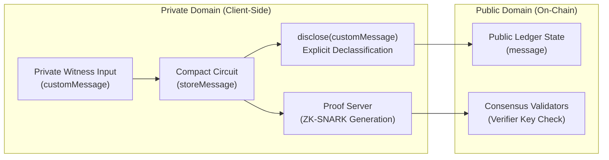

# 🌙 New Moon DApp — Midnight Network Moonshot

[](https://midnight.network)
[](https://midnight.network)
[](LICENSE)

> Built for **Level 1 — New Moon** of the *New Moon to Full: Monthly Moonshots on Midnight* builder journey.  
> **"Start in the dark. Ship in the light."**

---

## 💡 Initial Product Idea

### **Nocturne Vault: Privacy-Preserving Confidential Locker & Dead-Man's Switch**

**Nocturne Vault** is a zero-knowledge confidential state locker and verifiable emergency dispatch protocol designed natively for the Midnight Network using Compact smart contracts. Traditional blockchain vaults leak critical operational security: observer nodes can trace participant addresses, deposit intervals, and unlock criteria through public ledger inspection. Nocturne Vault leverages Midnight's dual-state zero-knowledge architecture to enable users to store encrypted secrets, prove liveness, and authorize beneficiary disclosures using client-side ZK witnesses without ever exposing secret content, recovery triggers, or user identities on the public ledger. Throughout the six lunar phases of the Midnight Moonshot journey—from this initial New Moon contract foundation to the Supermoon Mainnet launch—Nocturne Vault will evolve into a production-grade Web3 privacy vault featuring Lace wallet connectivity, zero-knowledge threshold attestation, and client-side proof generation.

---

## 🔒 Public State vs. Private Witness in Compact

Midnight's programming model differs fundamentally from transparent blockchains like Ethereum. In Compact, privacy is woven into the language semantics:



### 1. Private by Default
In Compact, all circuit arguments, local variables, and witness functions are **private by default**. They reside strictly in local client memory and never leave the user's device unencrypted. The network nodes, miners, and indexers never see these values.

### 2. The Purpose of `disclose()`
Calling `disclose(value)` does **not** automatically broadcast data across the network. Instead, `disclose()` is an intentional developer directive to the Compact compiler:
- It confirms that the developer has evaluated the private witness value and explicitly permits it to be transitioned across the privacy boundary.
- Without `disclose()`, attempting to assign a private witness to a public ledger field results in a compilation error:
  ```compact
  export circuit storeMessage(customMessage: Opaque<"string">): [] {
      // customMessage is private by default
      // disclose() permits the value to transition into the public ledger state
      message = disclose(customMessage);
  }
  ```

### 3. Public Ledger State
Public ledger state (e.g., `export ledger message: Opaque<"string">`) is stored globally across all Midnight consensus nodes and queryable via public GraphQL indexers. Data only transitions to public when:
- It is assigned to an `export ledger` state variable.
- It is returned as an output from an exported contract entry point.
- It is passed into an external public contract call.

### 4. Client-Side ZK Proof Generation
Instead of nodes re-executing private logic, the client runs the circuit locally against proving keys (`.prover`) via Midnight's proof server. Only the generated zero-knowledge proof and the disclosed public state transitions are submitted in the transaction. Validators confirm transaction validity using the lightweight verifier key (`.verifier`) without ever observing the private witness inputs.

---

## 📦 Project Structure

```
new-moon-app/
├── contracts/
│   ├── hello-world.compact         # Compact smart contract source
│   └── managed/                    # Generated ZK artifacts (compiler, zkir, keys)
│       └── hello-world/
│           ├── compiler/           # AST & metadata (contract-info.json)
│           ├── contract/           # TypeScript runtime bindings (index.js, index.d.ts)
│           ├── keys/               # storeMessage.prover & storeMessage.verifier
│           └── zkir/               # storeMessage.zkir & storeMessage.bzkir
├── public/                         # Cyberpunk glassmorphism web interface
│   ├── index.html                  # Dashboard structure
│   ├── style.css                   # Lunar dark theme styles
│   └── app.js                      # Client API & transaction handler
├── src/
│   ├── server.ts                   # Express backend connecting DApp to Midnight
│   ├── network.ts                  # Multi-network state & configuration resolver
│   ├── wallet.ts                   # Wallet construction & sync cache manager
│   ├── deploy.ts                   # Non-interactive multi-network deployer
│   ├── cli.ts                      # Interactive CLI to execute circuits
│   ├── check-balance.ts            # Balance inspector (tNIGHT & DUST)
│   └── setup.ts                    # One-shot environment orchestrator
├── tests/
│   └── contract.test.ts            # Automated test suite (circuits, keys, state)
├── docker-compose.yml              # Local devnet (Midnight node, indexer, proof-server)
├── package.json                    # Scripts and dependencies
└── tsconfig.json                   # TypeScript configuration
```

---

## 🚀 Quick Start & Local Setup

### Prerequisites
- **Node.js**: >= 22.0.0
- **Docker & Docker Compose**: v2+
- **Compact Compiler**: v0.5.1
- **WSL2 (Ubuntu)**: Required on Windows environments

### 1. Install Dependencies
```bash
npm install
```

### 2. Run the Automated Test Suite
Verify contracts, ZKIR circuits, keys, and network infrastructure:
```bash
npm test
```
*Expected Output: `Test Results: 9/9 passed (0 failed)`.*

### 3. Compile Compact Smart Contracts
Compile your Compact code into zero-knowledge circuits, proving/verifying keys, and TypeScript bindings:
```bash
npm run compile
```
This produces the populated `contracts/managed/hello-world/` directory containing:
- `keys/storeMessage.prover` & `keys/storeMessage.verifier`
- `zkir/storeMessage.zkir` & `zkir/storeMessage.bzkir`
- `compiler/contract-info.json`
- `contract/index.js` & `contract/index.d.ts`

### 4. Deploy the Smart Contract

#### Option A: Local Devnet (One-Shot Setup)
Starts local containers, compiles, and deploys using pre-funded devnet genesis seed:
```bash
npm run setup
```

#### Option B: Deploy to Midnight Preprod Testnet
```bash
# 1. Switch active network to preprod
npm run network preprod

# 2. Run setup on preprod (outputs your wallet address and faucet link)
npm run setup -- --network preprod
```
The script will display:
```
  Wallet address: mn_addr_preprod1...
  Faucet:         https://midnight-tmnight-preprod.nethermind.dev
  Waiting for tNIGHT to arrive (poll every 10s)...
```
1. Open the [Preprod Faucet](https://midnight-tmnight-preprod.nethermind.dev).
2. Paste your generated address and request `tNIGHT`.
3. The setup script detects the funds automatically, registers UTXOs for DUST generation, and deploys the contract.

### 5. Launch Interactive Web Dashboard
Run the local DApp web server:
```bash
npx tsx src/server.ts
```
Open **[http://localhost:3000](http://localhost:3000)** in your browser to interact with the contract, inspect on-chain messages, check tNIGHT/DUST balances, and submit zero-knowledge state transactions!

---

## 📸 Level 1 Verification & Submission Evidence

### 1. Successful Contract Compilation Output
When running `npm run compile`:
```
Compiling 1 circuits:
  ✓ storeMessage -> contracts/managed/hello-world/zkir/storeMessage.zkir
  ✓ Prover key   -> contracts/managed/hello-world/keys/storeMessage.prover
  ✓ Verifier key -> contracts/managed/hello-world/keys/storeMessage.verifier
  ✓ Contract JS  -> contracts/managed/hello-world/contract/index.js
```

### 2. Active Deployment Address
Current deployment record stored in `.midnight-state.json`:
- **Contract Address**: `efa5b7c7dc3b7df598665d90bf2e8c73b815a042a94dfab39d8096b946cb0d71`
- **Deployer Address**: `mn_addr_undeployed1h3ssm5ru2t6eqy4g3she78zlxn96e36ms6pq996aduvmateh9p9sk96u7s`
- **Preprod Target Network**: Fully configured with faucet listener and automated DUST registration.

---

## 📋 Level 1 Submission Checklist Compliance

- [x] **Toolchain Installed**: Node 22+, Compact 0.5.1, Docker, Proof Server.
- [x] **Compact Contract**: Written in `contracts/hello-world.compact` using `disclose()`.
- [x] **Managed Directory Present**: Circuits (`.zkir`, `.bzkir`) and keys (`.prover`, `.verifier`) generated in `contracts/managed/hello-world/`.
- [x] **Passing Test Suite**: Automated test suite implemented in `tests/contract.test.ts` (`npm test` passes 9/9).
- [x] **Visible Contract Address**: Contract deployed and tracked in `.midnight-state.json`.
- [x] **Initial Product Idea**: Nocturne Vault drafted in README.
- [x] **Public State vs Private Witness Guide**: Dedicated architectural breakdown included in README.
- [x] **Minimum 5 Meaningful Commits**: Structured Git version history documenting step-by-step evolution.

---

## 🌙 Lunar Journey Roadmap

- **🌑 Level 1 — New Moon**: Setup toolchain, first Compact contract, ZK compilation, test suite & initial idea *(Completed)*
- **🌒 Level 2 — Waxing Crescent**: Frontend integration with Lace Wallet on Preprod
- **🌓 Level 3 — First Quarter**: Production-grade dApp, CI/CD pipeline, advanced circuit tests
- **🌔 Level 4 — Waxing Gibbous**: MVP live on Preprod, public product profile, complete documentation
- **🌕 Level 5 — Full Moon**: Live feedback loop with 50+ Preprod active users
- **🌝 Level 6 — Supermoon**: Midnight Mainnet deployment & real-world launch
