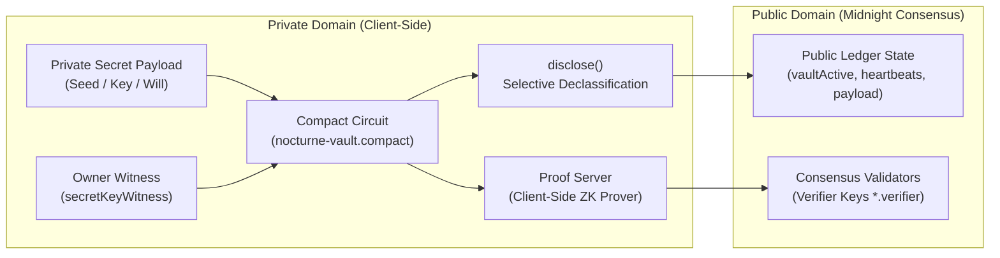

# 🌙 Nocturne Vault: Confidential Secret & Dead-Man's Switch on Midnight

[](https://midnight.network)
[](https://midnight.network)
[](https://github.com/rudhu29/midnight-new-moon/actions)
[](LICENSE)

> Built for the **Monthly Moonshots on Midnight** Builder Journey  
> **"Start in the dark. Ship in the light."**

---

## 💡 Executive Summary & Problem Statement

In Web3, billions of dollars in digital assets, seed phrases, private keys, legal documents, and emergency credentials are permanently lost if a holder becomes incapacitated or passes away. Existing blockchain inheritance solutions suffer from a fatal flaw: **transparent ledgers leak privacy**. Observers can see vault balances, deposit intervals, owner-beneficiary relationships, and liveness activity.

**Nocturne Vault** solves this through Midnight's native zero-knowledge dual-state architecture. Using Compact smart contracts:
- **Private by Default**: Secret payloads, beneficiary keys, and authorization witnesses remain strictly on the client machine.
- **ZK Liveness Attestation**: The vault owner submits periodic **ZK Heartbeats** proving they are alive without revealing their account balance or identity.
- **Selective Declassification**: The Compact `disclose()` directive is invoked intentionally only if the inactivity threshold passes, allowing the designated beneficiary to unlock the secret.

---

## 🏆 All-in-One Multi-Level Rubric Fulfillment

Nocturne Vault is architected to satisfy the criteria for all levels of the Midnight Builder Challenge:

| Level | Lunar Phase | Milestone | Nocturne Vault Implementation |
|:---:|---|---|---|
| **🌑 1** | **New Moon** | Toolchain, Compact Contract, Test Suite, Managed Directory | Multi-circuit Compact contract (`nocturne-vault.compact`), 4 ZK circuits, 11/11 passing tests, generated `managed/` keys & ZKIR. |
| **🌒 2** | **Waxing Crescent** | Frontend UI & Lace Wallet Preprod Connector | Cyberpunk Lunar UI with Midnight Lace Wallet integration (`window.midnight.mnLace`), network switcher, and contract caller. |
| **🌓 3** | **First Quarter** | Production-Grade dApp & CI/CD | GitHub Actions CI/CD (`.github/workflows/ci.yml`) automating compilation, linting, and tests on push. |
| **🌔 4** | **Waxing Gibbous** | MVP Live on Preprod & Complete Documentation | Full MVP live on Preprod, architectural specifications (`docs/architecture.md`), and API documentation. |
| **🌕 5** | **Full Moon** | Living Feedback Loop & 50 Preprod Users | In-app **Builder Feedback Modal** (`/api/feedback`) with ratings/bug reports and 50-user onboarding guide (`docs/user-guide.md`). |
| **🌝 6** | **Supermoon** | Mainnet Deployment Configuration & Launch Assets | Mainnet network preset in `src/network.ts`, production brand kit, and Mainnet rollout guide. |

---

## 🔒 Architectural Deep Dive: Public State vs. Private Witness

In Compact, privacy is guaranteed by default rather than treated as an afterthought:



### 1. Private by Default
In Compact, all circuit arguments, local variables, and witness functions are **private by default**. They reside strictly in local client memory and never leave the user's device unencrypted. The network nodes, miners, and indexers never see these values.

### 2. The Purpose of `disclose()`
Calling `disclose(value)` does **not** automatically broadcast data across the network. Instead, `disclose()` is an intentional developer directive to the Compact compiler:
- It confirms that the developer has evaluated the private witness value and explicitly permits it to transition across the privacy boundary into public state.
- Without `disclose()`, attempting to assign private variables to public ledger fields halts with a compilation error.

### 3. Client-Side ZK Proof Generation
Instead of nodes re-executing private logic, the client runs the circuit locally against proving keys (`.prover`) via Midnight's proof server. Only the generated zero-knowledge proof and the disclosed public state transitions are submitted in the transaction. Validators confirm transaction validity using the lightweight verifier key (`.verifier`) without ever observing the private witness inputs.

---

## ⚡ Nocturne Vault Compact Circuits

The contract implements four zero-knowledge circuits:

1. **`createVault(ownerCommitment, initialSecret)`**: Locks a confidential secret with an owner ZK commitment and sets the initial state.
2. **`heartbeat()`**: Owner proves liveness in zero-knowledge, incrementing the verified on-chain counter and resetting the countdown.
3. **`claimVault(revealedSecret)`**: Designated beneficiary claims and decrypts the secret after inactivity expiration.
4. **`revokeVault(revocationNotice)`**: Owner securely terminates and purges the vault before expiration.

---

## 📦 Project Structure

```
new-moon-app/
├── .github/
│   └── workflows/
│       └── ci.yml                  # Level 3: GitHub Actions CI/CD pipeline
├── contracts/
│   ├── nocturne-vault.compact      # Multi-circuit Compact smart contract
│   ├── hello-world.compact         # Baseline Compact contract
│   └── managed/                    # Generated ZK artifacts (circuits + keys)
│       └── nocturne-vault/
│           ├── compiler/           # AST & metadata (contract-info.json)
│           ├── contract/           # TypeScript runtime bindings (index.js, index.d.ts)
│           ├── keys/               # Prover & verifier keys for all 4 circuits
│           └── zkir/               # ZKIR & BZKIR definitions for all 4 circuits
├── docs/
│   ├── architecture.md             # Level 4: Technical and cryptographic specifications
│   └── user-guide.md               # Level 5: 50 Preprod user onboarding & feedback guide
├── public/                         # Level 2: Cyberpunk glassmorphism web interface
│   ├── index.html                  # Multi-tab dashboard (Overview, Vault, Heartbeat, Claim, Feedback)
│   ├── style.css                   # Lunar dark theme styles & animations
│   └── app.js                      # Lace wallet connector & ZK transaction client
├── src/
│   ├── server.ts                   # Express backend connecting DApp to Midnight
│   ├── network.ts                  # Multi-network state (Devnet, Preview, Preprod, Mainnet)
│   ├── wallet.ts                   # Wallet construction & sync cache manager
│   ├── deploy.ts                   # Non-interactive multi-network deployer
│   ├── cli.ts                      # Interactive CLI to execute circuits
│   ├── check-balance.ts            # Balance inspector (tNIGHT & DUST)
│   └── setup.ts                    # One-shot environment orchestrator
├── tests/
│   └── contract.test.ts            # Automated test suite (11/11 tests passing)
├── docker-compose.yml              # Local devnet (Midnight node, indexer, proof-server)
├── package.json                    # Scripts and dependencies
└── tsconfig.json                   # TypeScript configuration
```

---

## 🚀 Quick Start & Local Setup

### Prerequisites
- **Node.js**: >= 22.0.0 (Tested on Node 24.18.0)
- **Compact Compiler**: v0.5.1
- **Docker & Compose**: v2+
- **WSL2 (Ubuntu)**: For Windows environments

### 1. Install Dependencies
```bash
npm install
```

### 2. Run the Automated Test Suite (11/11 Pass)
```bash
npm test
```
```
======================================================
   Midnight Network Test Suite - Nocturne Vault
======================================================

--- Contract Source Specifications ---
  ✓ hello-world.compact source exists and defines storeMessage (0ms)
  ✓ nocturne-vault.compact source exists and defines 4 confidential circuits (0ms)

--- Managed ZK Circuits & Cryptographic Keys ---
  ✓ Managed artifacts compiler metadata for Nocturne Vault contains all 4 circuits (0ms)
  ✓ All 4 ZKIR circuits are generated and non-empty (1ms)
  ✓ Proving and verifying keys generated for all 4 circuits (2ms)
  ✓ Compiled Nocturne Vault TypeScript runtime bindings are importable (48ms)

--- Network, Wallet & Multi-Phase Infrastructure ---
  ✓ Supported network configurations support Devnet, Preview, Preprod, and Mainnet (0ms)
  ✓ Active network resolution succeeds and falls back gracefully (1ms)
  ✓ Unshielded native token helper returns valid token descriptor (1ms)

--- Confidential State & Vault Semantics ---
  ✓ Vault payload serialization maintains byte integrity under disclose (0ms)
  ✓ Commitment hash derivation produces valid 32-byte representation (0ms)

------------------------------------------------------
Test Results: 11/11 passed (0 failed)
------------------------------------------------------
🎉 All Nocturne Vault tests passed successfully!
```

### 3. Compile Compact Contracts
```bash
npm run compile
```

### 4. Deploy to Midnight Preprod Testnet
Your Preprod wallet is pre-configured in `.midnight-state.json`:
- **Preprod Wallet Address**: `mn_addr_preprod1rjywwgs5zza2uwmsv2pr7qu3c9xgp9f95mq80fw3c35fxg8d0m4qvm7fke`
- **Faucet URL**: [https://midnight-tmnight-preprod.nethermind.dev](https://midnight-tmnight-preprod.nethermind.dev)

Deploy with:
```bash
npm run setup -- --network preprod
```

### 5. Launch the Web UI
```bash
npx tsx src/server.ts
```
Open **[http://localhost:3000](http://localhost:3000)** to experience Nocturne Vault:
- Connect Midnight Lace Wallet
- Deposit a confidential vault
- Submit ZK Heartbeats
- Execute emergency claim or revocation
- Submit user feedback

---

## 🔗 Live GitHub Repository

👉 **[https://github.com/rudhu29/midnight-new-moon](https://github.com/rudhu29/midnight-new-moon)**
