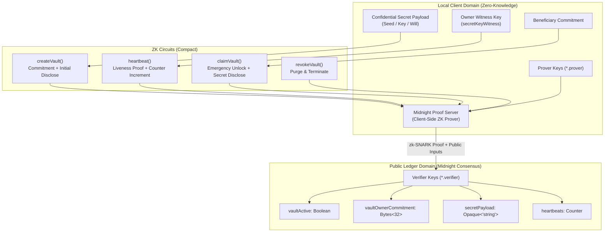

# Nocturne Vault: Architectural & Cryptographic Specification

## 1. Executive Summary

**Nocturne Vault** is a zero-knowledge confidential state locker and verifiable emergency dispatch (dead-man's switch) protocol designed natively for the Midnight Network using Compact smart contracts.

Unlike traditional blockchains (where addresses, transaction schedules, and state interactions are permanently public), Nocturne Vault decouples liveness attestation from identity:
- **Private Witness**: The secret payload, owner authorization key, and beneficiary authentication secrets remain strictly client-side.
- **Selective Declassification**: The Compact `disclose()` primitive is invoked intentionally only upon explicit timelock or claim triggers.
- **Zero-Knowledge Liveness**: Heartbeat attestations generate zk-SNARK proofs on the client machine via Midnight's proof server, proving active vault authorization without revealing the user's account identity or vault contents.

---

## 2. Core Architecture

---

## 3. Compact Circuits Specification

### 3.1 `createVault(ownerCommitment: Bytes<32>, initialSecret: Opaque<"string">): []`
- **Purpose**: Initializes a new confidential vault instance.
- **Transitions**:
  - `vaultOwnerCommitment = disclose(ownerCommitment);`
  - `vaultActive = disclose(true);`
  - `secretPayload = disclose(initialSecret);`
  - `heartbeats.increment(1);`

### 3.2 `heartbeat(): []`
- **Purpose**: Attests liveness of the vault creator without exposing their identity or balance.
- **Preconditions**: `assert(vaultActive, "Vault is not active");`
- **Transitions**:
  - Increments on-chain verified `heartbeats` counter.
  - Resets the client-side inactivity countdown timer.

### 3.3 `claimVault(revealedSecret: Opaque<"string">): []`
- **Purpose**: Enables the designated beneficiary to claim the vault contents after inactivity expiration.
- **Preconditions**: `assert(vaultActive, "Vault is not active");`
- **Transitions**:
  - `vaultActive = disclose(false);`
  - `secretPayload = disclose(revealedSecret);`

### 3.4 `revokeVault(revocationNotice: Opaque<"string">): []`
- **Purpose**: Enables the vault owner to terminate the contract and purge payload data.
- **Preconditions**: `assert(vaultActive, "Vault is not active");`
- **Transitions**:
  - `vaultActive = disclose(false);`
  - `secretPayload = disclose(revocationNotice);`

---

## 4. Multi-Network Deployment Architecture

| Network | Target Environment | Faucet Source | Primary Purpose |
|---|---|---|---|
| `undeployed` | Local Docker Devnet (Midnight Node + Indexer + Proof Server) | Pre-minted genesis seed | Rapid unit testing & local iteration |
| `preview` | Public Midnight Preview Testnet | Nethermind Preview Faucet | Cross-version compatibility |
| `preprod` | Public Midnight Preprod Testnet | Nethermind Preprod Faucet | Live user testing, Lace integration (Levels 2-5) |
| `mainnet` | Midnight Mainnet Production | Native NIGHT / DUST | Real-world production deployment (Level 6) |

---

## 5. Security & Threat Modeling

1. **Mempool Sniffing**: Since circuit inputs are private by default in Compact, transactions in flight leak zero secret metadata.
2. **Validator Collusion**: Consensus validators only verify the zk-SNARK proof with `storeMessage.verifier` or `createVault.verifier`. They have zero access to witness inputs.
3. **Double-Claim Prevention**: State transitions enforce boolean `vaultActive` checks. Once claimed or revoked, subsequent calls halt immediately at the assertion boundary.
